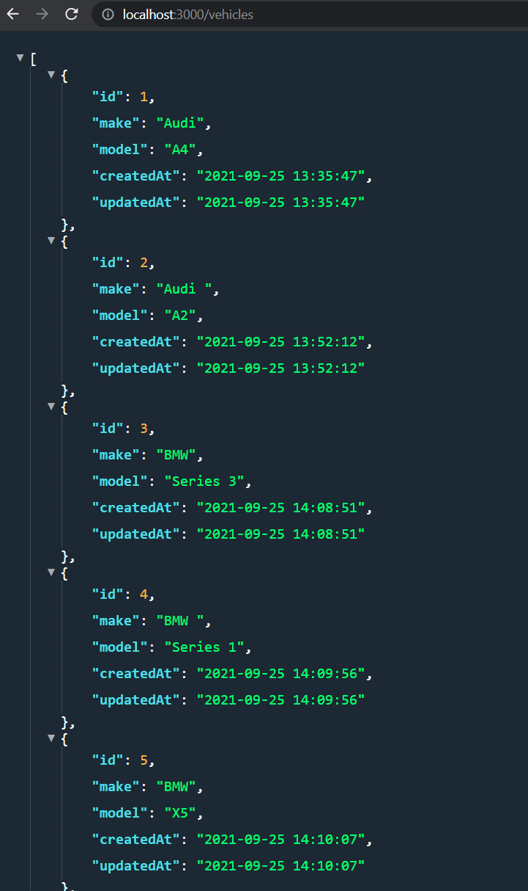
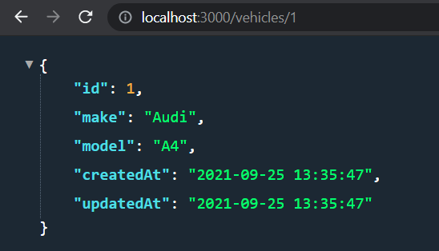
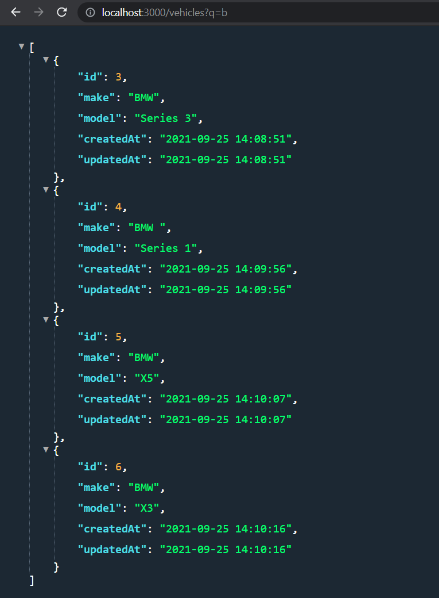

# Vehicle API (Node.js)

## Table of Contents
* [General info](#general-info)
* [Technologies](#technologies)
* [Setup](#setup)
* [Results](#results)
* [Improvements](#improvements)

## General info
An API that reads from a database table (vehicles.db) and returns all the rows in the JSON format. This app uses Node, Express, Sequalize and Sqlite3.

## Technologies
Project is created with:
* Node version: v14.15.0
* Visual Studio Code version: 1.60.2
* Windows OS: Windows_NT x64 19043.1237

## Setup
### Installing Node 
To run this project, download and install Node from Node.js website (https://nodejs.org/en/)

### Quick Start
To install dependencies run the following in the terminal: 

```
npm install
```
Server on localhost:3000
```
npm start
```
Dev Server (Nodemon)
```
npm run dev
```

## Results 

I am running JSON Viewer Pro (chrome extension)

Typing http://localhost:3000/vehicles will give the following result



Typing http://localhost:3000/vehicles/1 will give the following result



Typing http://localhost:3000/vehicles/?q=b will give the following result



## Improvements
* Only a single CRUD action has been implemented. To develop the API further other CRUD actions should be implemented.
*  Sqlite3 database was used for the project. For the future either MySQL or PostgreSQL should be used. Both are easily scalable and suitable for big databases.

